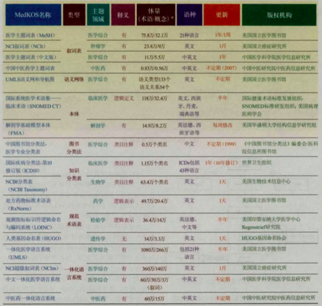
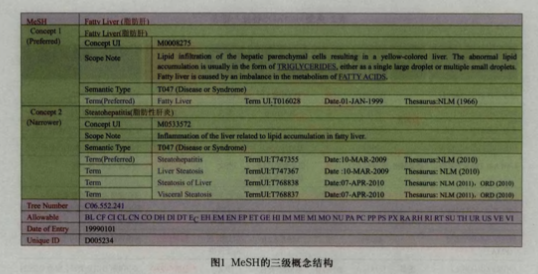

### 1、专业电子词典与通用电子词典的异同
- 各领域专业电子词典介绍

   - 金融
   - 计算机
   - 医学
   - 法律

- 专业电子词典与通用电子词典的异同

  相同点：

   - XXX
   - XXX

  不同点：

  - XXX
  - XXX

### 2、医学领域电子词典的需求分析
- 用户分析

  - 译员
    使用场景和目的：

  - 专业人士
    使用场景和目的：

- 目前主流的医学词典分析

  （介绍、产品逻辑结构、词条主界面、功能分析）

- 需求收集

  本小组主要从以下几个方面收集用户需求：

  - 问卷调查
  - 新媒体
  - 数据分析
  - 用户访谈
<<<<<<< HEAD
  - 论文与行业资讯：  
    在目前医学领域双语词典的编纂中，主要有如下的问题：  
    1. 同义术语的标注  
    术语的同义现象是建立在表达同一个专业概念的不同术语单位基础上的一种语义关系。现代医学双语词典中暂时还缺乏关于在术语系统功能化条件下使用某一同义术语的相关信息。那么, 对医学双语词典中同义术语的收词释义过程的分析和描写, 划分同义术语的类型, 确定现代医学术语的特点, 也就变得十分迫切，更具有现实意义。
    同义术语，如艾滋病和获得性免疫缺陷综合征；库利贫血和珠蛋白生成障碍性贫血、地中海贫血等等。目前在医学词典中，某一术语的同义术语通常在括号中列出，多个同义术语用逗号隔开。没有任何有关某一术语在某一学科领域优先使用的信息标注。
    既然医学术语系统中存在大量的同义术语, 那么术语的整理和规范都是十分必要的, 而且这项工作除了医学领域的专家, 还应该有语言学家、词典编纂学家和词汇学家的积极参与。这对现代医学术语词典编纂工作意义重大。  
    2. 词典落后于语言现实  
    随着医学的发展，新词不断涌现，传统而言，词典往往落后于语言现实。外来术语，一般先经翻译在译文或译届中使用，导致了词典的编纂跟不上新词的发展。同时，写队伍不精、产品粗制滥造的现象时有发生。为了解决这一问题，需要编者在从事词典编纂的过程中，同时从事医学的学术研究，了解领域的最新进展。这就需要倾注大量的人力物力。  
    3. 不同医学体系的交流  
    各国在医学领域的发展进度、体系都不尽相同。在许多医学领域，有许多不同国家并行发展的体系。如疾控医学是在我国传统的预防医学体系上发展起来的，许多传统的理念与方法已经不能为新兴领域所融合与接纳，需要更多更快地引进与接受世界范围内本学科前沿发展的理论、技术与方法，这就使得在文献信息的国际交流与沟通中有着重要作用的词典编写出版成为必要，去适应了学科发展的需要，助力学科广大专业技术人员学习了解国外有关文献信息、为获取相关最新技术与知识方面提供方便。  
    4. 非医学专业用户使用问题  
    由于公众主要是非医学专业用户，而非专业用户获得医学信息的效果并不理想。主要原因一是用户习惯使用搜索引擎而不是专业电子词典搜索术语，二是专业词典门槛稍高，需要一定的医学知识和检索知识。口语化的检索很大程度上影响了检索质量与效率。因此，在非专业用户用词和专业医学术语之间建立联系非常重要。
=======
  
  也调查了相关的论文与行业资讯：  
  在目前医学领域双语词典的编纂中，主要有如下的问题：  
  1.同义术语的标注  
  术语的同义现象是建立在表达同一个专业概念的不同术语单位基础上的一种语义关系。现代医学双语词典中暂时还缺乏关于在术语系统功能化条件下使用某一同义术语的相关信息。那么, 对医学双语词典中同义术语的收词释义过程的分析和描写, 划分同义术语的类型, 确定现代医学术语的特点, 也就变得十分迫切，更具有现实意义。
  同义术语，如艾滋病和获得性免疫缺陷综合征；库利贫血和珠蛋白生成障碍性贫血、地中海贫血等等。目前在医学词典中，某一术语的同义术语通常在括号中列出，多个同义术语用逗号隔开。没有任何有关某一术语在某一学科领域优先使用的信息标注。
  既然医学术语系统中存在大量的同义术语, 那么术语的整理和规范都是十分必要的, 而且这项工作除了医学领域的专家, 还应该有语言学家、词典编纂学家和词汇学家的积极参与。这对现代医学术语词典编纂工作意义重大。  
  2.词典落后于语言现实  
  随着医学的发展，新词不断涌现，传统而言，词典往往落后于语言现实。外来术语，一般先经翻译在译文或译届中使用，导致了词典的编纂跟不上新词的发展。同时，写队伍不精、产品粗制滥造的现象时有发生。为了解决这一问题，需要编者在从事词典编纂的过程中，同时从事医学的学术研究，了解领域的最新进展。这就需要倾注大量的人力物力。  
  3.不同医学体系的交流  
  各国在医学领域的发展进度、体系都不尽相同。在许多医学领域，有许多不同国家并行发展的体系。如疾控医学是在我国传统的预防医学体系上发展起来的，许多传统的理念与方法已经不能为新兴领域所融合与接纳，需要更多更快地引进与接受世界范围内本学科前沿发展的理论、技术与方法，这就使得在文献信息的国际交流与沟通中有着重要作用的词典编写出版成为必要，去适应了学科发展的需要，助力学科广大专业技术人员学习了解国外有关文献信息、为获取相关最新技术与知识方面提供方便。

  

>>>>>>> e871bf5d416158368dfe3af7e9eff9502cdc37ef
- 用户痛点分析

  （总结用户提出的问题）

- 需求整理

  （总结我们要提出的需求）

   系统假设和约束条件：不考虑版权限制及资金因素

### 3.1 医学领域术语研究进展

医学知识组织体系（Medical Knowledge Organization Systems. MedKOS)广泛应用于生物医学研究及实践活动过程中，用来组织和表述各类生物医学数据资源。

#### 3.1.1 概要

目前的MedKOS类型主要有三类：
①词汇表类，强调对概念的解释， 形式简单，不涉及复杂的语义关系，如权威规范文档、词汇表、术语表、词典、指南等；
②分类体系：强调概念间的层级聚合和类别体系，起到范畴归类作用，如分类法、知识分类体系、类目表等；
③关联组类：强调概念间各种关系的掲示，如叙词表、语义网络、本体等。

医学领域中常见的一些医学术语体系如下表：
<<<<<<< HEAD
 -  
=======

>>>>>>> e871bf5d416158368dfe3af7e9eff9502cdc37ef

其中医学领域最具影响力的一体化语言系统整合了上述三种类型的知识组织体系，充分结合了各种知识 组织体系的优点.目前主要一体化语言系统的实线活动包括，美国国立医学图书馆(NLM)建立的UMLS (Unified Medical Language System, 一体化医学语言系统）;美国国立癌症研究所(NCI)建立的Nclm (NCI Metathesaurus, NCI超级叙词表)中国医学科学院医学信息研究所建立的中文一体化医学语言系统；以及中国中医研究院中医药信息研究所发展建立的中医药一体化语言系统。

#### 3.1.2 几种典型的医学术语体系构建模式

##### 3.1.2.1 MeSH 医学主题词表

 MeSH(Medical Subject Headings) 医学主题词表是生物医学领域最著名的大型综合性叙词表。

###### MeSH 的构建模式

 MeSH 医学主题词表由“主题词（叙词）— 概念 — 术语（入口词）”三级主题词类组成。一个主题词类可以包含多个概念、一个概念包含多个术语，每个概念内的术语表示精确的同义关系，主题词类多个概念之间的关系可能为同义、广义、狭义和相关关系。每个主题词类的一个概念被推选为优选概念，并被指定为主题词，每个概念中的一个术语被推选为优选术语。
  MSH的三级概念结构避免了传统叙词表二级结构带来的关系丢失或歧义现象,如主题词与入口词之间的关系可能是同义、近义或反义关系, MeSH的三级结构可以将这些语义关系明确清晰地标识出来,有利于计算机的理解和处理,同时也保留了传统叙词表二级结构的功能。

<<<<<<< HEAD
 -  
=======

>>>>>>> e871bf5d416158368dfe3af7e9eff9502cdc37ef

######  MeSH 的术语映射机制

  MeSH的表内和表间术语映射机制由主题词表、副主题词表,增补概念表和树形结构表四个部分组成,MeSH增补概念表的术语多来自文献,是对主题词表的补充和扩展,MeSH增补概念词不是主题词,但它至少与一个MeSH主题词建立映射关系。另外,McSH中的每个概念都标识有UMLS语义网的语义类型,通过语义类型建立起与外部语义网络高层类目间的映射关联,共享UMLS语义网的丰富语义关系。

##### 3.1.2.2 SNOMED CT 国际系统医学术语集——临床术语

  SNOMED CT(Systemized Nomenclature of Medicine-ClinicalTerms,国际系统医学术语集——临床术语)是医学临床广泛应用、结构独特的大型医学知识本体。本体是一种对共享概念体系的明确的形式化规范描述，SNOMED CT 是医学领域一例成功利用知识本体的研究成果。

###### SNOMED CT的概念分类体系

  基于医学特定的概念分类理论，SNOMED CT构建了顶级概念分类框架,将32万多个具有唯一含义并经过逻辑定义的概念，分别编入19个顶级概念类（轴）,通过上下位语义关系，形成以某一特征属性为核心的概念等级结构。每个概念都有一个完全指定名称（FSN）及相对应的一个首选术语和若干个同义术语，FSN由概念名称和括号中的限定词组成,如“ Pneumonia（ disorder），肺炎（疾病）”,括号中的内容为概念的语义标签,表明其在语义上所属的类别。
  SNOMED CT的连接概念以“概念1+连接概念+概念2”三元组表示,连接概念是SNOMED CT 19个顶级概念轴中的一类,包括约60个概念,每个连接概念都进行域,范围,角色层级结构,角色组的明确限定,以保证连接概念的正确使用。
  SNOMED CT的语义关系包括定义性,限定性,历史性和附加性,其中最重要的定义性语义关系包括两类:“is_a”关系和“ Atrribute”关系, SNOMED CT通过纵向的上下位关系和横向的属性关系确定两个概念间的具体语义关系, SNOMED CT大约包括136万个语义三元组, SNOMED CT的属性关系是通过上述连接概念表达的,通过连接概念,将归属于同一概念轴和不同概念轴的概念连接起来,形成具有内在义关联、能清晰表达临床信息,便于计算机理解的短句.

###### SNOMED CT的数据结构

  概念表、描述表、关系表是 SNOMED CT体系结构的三个重要部件。概念表收录了19个顶级概念轴中约32万条具有唯一含义、并经过逻辑定义的概念;描述表收录了80多万条能够代表某个具体概念的术语及该概念的同义词;关系表包括约136万个三元组语义关联。

##### 3.1.2.3 UMLS 

  UMLS(Unified Medical Language System)是美国国立医学图书馆(NLM)自1986年起研究和开发的一体化医学语言系统。它包括3个部分：超级叙词表(Metathesaurus)，是UMLS的核心数据库，是由来自各种受控词表的概念和术语以及它们之间的关系所构成的集合；语义网络( Semantic Network)，是一套类别和关系，用于对Metathesaurus之间的条目加以分类和关联；和专家词典( Specialist Lexicon) ，是一个词典信息数据库，供自然语言处理工作使用。UMLS主要旨在供医学信息学领域的信息系统开发人员使用。NLM没有把标准的生物医学词汇作为建立超级叙词表的目标,而是要构建一个整合各来源词表中的生物医学概念、术语、词汇及其等级范畴的集成系统, 其宗旨是解决因为各系统的差异性和信息资源的分散性所造成的检索困难。目前，研究人员所能获得和使用的生物医学资源数量庞大，当对医学文献进行搜索的时候，检索到的文档数量巨大于是就成了一个问题。UMLS旨在通过促进那些能够理解生物医学语言的计算机系统的开发工作，来加强对于这些文献的获得和使用。这一目标是通过攻克两大障碍来实现的：“不同机读型来源和不同人员表达相同概念时所采用的形形色色的方式”与“有益的信息在许多互不相同的数据库和系统之间的分发和传播”。  
  超级叙词表的关注焦点是概念,而不是词汇、名称或术语,其词汇的收集和组织是以传递概念的涵义为目的的。它是依据概念组织起来的,将具有相同概念而来源不同的词汇及其变体通过特定概念标识CUI( unique concept identifier)联系在一起。在超级叙词表中,通过多种方式表达概念涵义, 包括概念定义、概念语义类型、概念内关系、间关系, 以及概念被使用的信息。所有这些概念表达方法都可以帮助我们识别和理解来源词表中各个单独的概念。

 ###### UMLS的构建模式：

  生物医学领域，跨语言多表集成的知识组织体系，整合了上百个异构异质MedKOS中的上千万个概念名称及其相关信息，umls由三个密切关联的知识源构成。  
  （1）超级叙词表：整合了166部生物医学领域的叙词表、分类表、本体、疾病编码集、标准化术语表等单一知识组织体系，2012AA版UMLS包括术语10810680条，概念单元2669792个，涵盖21种语言。  
  超级叙词表以概念为核心进行组织，每个概念代表不同来源知识组织系统同义词的集合，超级叙词表概念结构的设计为同义概念的组织，归并搭建了基本构架，基于概念唯一标识符（CUI），原形术语唯一标识符（LUI）、字符串唯一标识符（SUI），将不同的MedKOS同一概念的各种名称和变体形式连在一起，搭建起知识组织体系间的语义关联。超级叙词表概念结构示例如图。 
  -  
  超级叙词表通过对数据文档、元数据的合理设计和布局，将各来源词表纷繁庞杂的信息进行有序整合，通过概念名称文档，关系属性文档，描述属性文档等20多个文档的巧妙设计，实现了异构异质资源的同构化表示，并充分保留和继承了各来源表的原始信息，超级叙词表的每个来源表既是全局中的一个组成部分，又是一个独立的知识组织体系，既可整合利用，也可被单独词用。  
  （2）语义网(semantic network)：umls语义网既是umls的一个组成部分，也是一个独立的顶级医学语义网络。语义网由语义类型和语义关系构成，语义类型是语义网络中的节点，语义关系是节点之间的链接。如“后天畸形（语义类型1）+affects（语义关系）+细胞功能（语义类型2）”。语义类型有133个，涵盖了许多领域宽泛词汇的范畴；语义关系有54个，包括1个等级关系链（isa）和53个非等级的相关关系链。
  基于UMLS语义网，为知识组织体系中的概念标识语义类型，可使其继承语义网的丰富语义关系。UMLS语义网具有全局统控作用，它可使完全相异的知识组织体系使用一个共同的语义网络，是一种基于全局本体统控、各来源表语义互联的模式，下图显示概念“Pneumonia，Bacterial（细菌性肺炎）”在超级叙词表多个知识组织系统中的语义互联情况。  
  -  
  （3）专家词典和工具：是超级叙词表建立和维护所需的生物医学词汇库和一组工具集，主要用于超级叙词表同义概念的自动归并，减少人工构建词表的复杂程度。

  ###### UMLS 的发展：

  UMLS 语义网络在一体化医学语言系统内部及外 部都得到了广泛应用。在系统内部，结合语义类型及语义类型间的关系可以精确表达叙词表中概念之间的关系，UMLS语义网络利用语义类型和语义关系建立一种通用规则，来标引系统中的海量叙词，从而实现各个词表中的词汇互通和术语转换。
  在系统外部，李亚子等基于UMLS的语义网络构建顶层本体，将构建的症状本体、检查本体、药物本体、医疗法规本体、医疗器械本体等与顶层本体中对应的语义类型进行映射，并对其实例的关系进行等价、扩展、阻断3种关系的细化后构建了公共健康知识库，实现了本体间的关联;   李岩等基于UMLS语义网络进行语义标引与检索，在检索信息时，先找出概念 C1、C2的语义类型，再从语义网络中确定对应的语义关系，然后从知 识库中检索出相关知识，实现语义检索；还有学者基 于 UMLS 语义网络进行问答式检索，T.Delbecque 等对大量的医学文本进行训练，抽取出 UMLS 中的部分语义类型，以此为基础来实现医学领域问答系统中的命名实体识别; W．Weiming 等提出了一种 基于 UMLS 等级结构进行语义聚类的新方法，以概念的语义类型或者上位类作为聚类的准则;N.Benis 等基于 UMLS 和基因本体( GO) ，借鉴FrameNet 的 标注规则，对从GoPubMed 搜索引擎中采集的信息进 行标注，构建了生物医学领域的框架网络本体BioOntoFN。

 ### 3.2 医学专业电子词典构建的一些畅想

#### 3.2.1 编纂模式   

##### 众源模式    

##### 可持续编纂模式  

先根据权威医学文献建立某一特定疾病的语料库。词条从这一语料库中提取。每个词条都包含从语料库中选出的例句作为对释义的补充，给使用者们提供词头的词汇信息和使用示范。无需等到整个项目完工之后再面向公众投入使用，而是可以在每个疾病词部编写完成之后立即上线。  

##### 多数据库对接模式

建立医疗语义搜索引擎所必需的临床标准术语库，不断优化与国内外医院电子病历系统的对接，最终实现英汉双语的自由转换，让中国患者与研究者便捷地搜索到国内外可信内容。

<<<<<<< HEAD

=======
>>>>>>> e871bf5d416158368dfe3af7e9eff9502cdc37ef
###### 适应性搜索系统  

能够记录并保存用户在搜索不同词条时进行的操作。记录下一些操作后，特定词条的初始化启动方式就可以自动改变，在达到一定标准之后优先显示某些查询频率更高的信息。把词典用户的“功能需求”和“使用需求”相结合，进行科学的分析推论，编者们就可以对词库系统做出设置，使得词汇的查询向不同用户导出不同的最合适信息。  

#### 3.2.2 交互方式和呈现形态 

###### 定制个性化词典

每一个独立IP地址运行过的任务都将被保存和处理，这些信息经过专业分析之后，可以被用于改进现有的网络词典系统，以适应每一位用户的个性需求。  
    
###### 多媒体搜索  

随着互联网技术的发展，未来更应出现一种融词典、百科全书和医学文献为一体的 “多媒体工具书” ， 如查阅者输入某种疾病，这种工具书提供对应词和释义（词典功能 ），提供该疾病的详细介绍（百科全书功能）和主要相关文献（文献检索功能），甚至还可以提供相关疾病影像。这种未来在线医学词典的内容丰富、检索便利，应是医学双语词典的发展方向。
###### 用户词表与UMLS词表之间映射  
实现用户词与专业术语之间的“互相翻译”。

#### 3.2.2 交互方式和呈现形态

可借鉴SNOMED CT 医学本体概念及语义关系揭示的明确化、模型化和机器可理解特点，可增加词条与其它词条的映射链接关系的呈现，比如相关词，联想词，词条所属概念体系的其它常用词，提供同义词，近义词，易混词辨析以及与该词条语义上下位关系的词，帮助译员更好的理解和辨析词目的意思。

